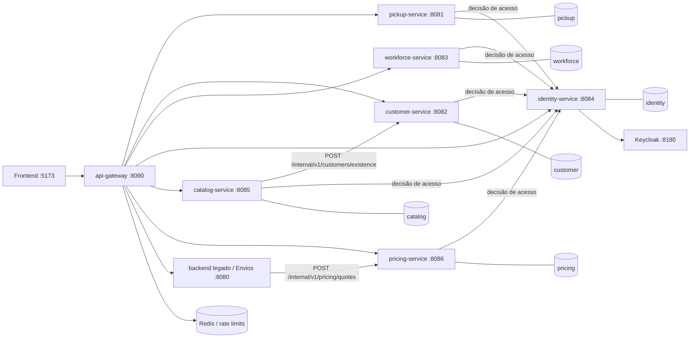

# Arquitetura de microserviços

## Decisão

O LTFT Comand Center migra do monólito modular para microserviços pelo padrão *strangler*. Cada serviço é um processo implantável, valida o mesmo token OIDC emitido pelo Keycloak e é o único proprietário da sua base de dados. Durante a transição, o backend legado continua disponível para os domínios ainda não extraídos.

Não são permitidas chaves estrangeiras, `JOIN`, repositórios JPA ou acessos SQL entre bases de serviços diferentes. As referências externas são UUIDs e os dados necessários para preservar o histórico são guardados como snapshots.

## Limites e propriedade dos dados

| Serviço | Responsabilidade | Base própria | Dados principais |
|---|---|---|---|
| `api-gateway` | entrada pública, autenticação inicial, limites e encaminhamento | não aplicável | sem dados de negócio; rate limits efémeros em Redis |
| `identity-service` | JML, revogação e auditoria de acessos | `identity` | estados de acesso e eventos de auditoria |
| `customer-service` | clientes, destinatários e validação fiscal | `customer` | clientes, contadores de código e destinatários |
| `pickup-service` | locais operacionais para entrega e levantamento | `pickup` | pontos Pickup e horários |
| `workforce-service` | colaboradores e catálogos profissionais | `workforce` | colaboradores, perfis e categorias |
| `catalog-service` | serviços operacionais e zonas de faturação | `catalog` | grupos, serviços, zonas, limites e disponibilidade |
| `pricing-service` | tabelas, rotas independentes e simulações | `pricing` | planos, rotas, escalões e cotações |
| `shipment-service` | envios, recolhas e respetivo histórico | `shipment` | expedições, estados e snapshots financeiros/operacionais |

O Keycloak continua externo aos serviços e é a fonte de identidade e roles. O API Gateway valida primeiro o JWT; as
permissões e o estado JML são novamente validados em cada serviço, sem confiar apenas no gateway.

## Integrações entre serviços

- Criação de cliente: `customer-service` cria o cliente e o destinatário inicial na mesma base e transação.
- Criação de envio: `shipment-service` confirma referências através das APIs de Clientes, Catálogo e Preços; guarda os identificadores e snapshots do destinatário, rota, preço, IVA e serviço utilizados.
- Restrições de serviço por cliente: `catalog-service` guarda apenas o UUID do cliente. A existência pode ser validada pela API de Clientes, nunca por chave estrangeira.
- Cotação: `shipment-service` pede uma cotação a `pricing-service`. O resultado aceite fica imutável no envio.
- Pontos Pickup: `shipment-service` guarda o UUID e um snapshot do ponto selecionado, preservando auditorias mesmo que o ponto seja posteriormente alterado.
- Operações que atravessam serviços não usam transações distribuídas. Devem ser idempotentes e, quando passarem a ser assíncronas, usar outbox e eventos versionados.

## Contratos e compatibilidade

- APIs públicas sob `/api/...`; integrações internas futuras sob `/internal/v1/...`.
- IDs globais em UUID e códigos de negócio preservados separadamente.
- Erros com `timestamp`, `status`, `message` e, numa evolução compatível, `code` e `traceId`.
- Alterações incompatíveis criam nova versão do contrato.
- `GET` e `HEAD` têm a mesma matriz de autorização.
- Todos os comandos de escrita devem aceitar uma chave de idempotência quando o respetivo workflow atravessar serviços.

## Migração incremental

1. `pickup-service`: primeira extração, sem dependências de dados externas.
2. `customer-service`: mantém Clientes e Destinatários juntos para conservar a criação atómica atual.
3. `workforce-service`: extrai os catálogos atuais antes da persistência completa de colaboradores.
4. `catalog-service`: remove a FK a Clientes e substitui-a por referência UUID validada por contrato.
5. `pricing-service`: passa a devolver cotações completas e imutáveis.
6. `shipment-service`: última extração, depois dos contratos de Clientes, Catálogo e Preços estarem estáveis.
7. `identity-service`: separa auditoria/JML do backend legado, mantendo o Keycloak como fornecedor OIDC.
8. Introdução do API Gateway concluída; remoção final do backend legado apenas depois de extrair Envios.

Cada extração exige: migração e reconciliação dos dados, execução paralela controlada quando aplicável, testes de contrato, troca do endpoint consumidor, observação e só depois remoção das tabelas legadas.

## Estado atual

`pickup-service`, `customer-service`, `workforce-service`, `identity-service`, `catalog-service` e `pricing-service` são serviços autónomos.
Cada um tem projeto Maven, imagem Docker, PostgreSQL dedicado, migrations Flyway, validação OIDC, CORS, matriz de
autorização e testes próprios. A revogação imediata e a role esperada são confirmadas no `identity-service` em todos os
pedidos autenticados; uma indisponibilidade desse serviço fecha o acesso em vez de o permitir.
O frontend usa apenas `VITE_GATEWAY_API_URL`, por omissão `http://localhost:8090/api`. O gateway encaminha cada rota
para o serviço proprietário e mantém Envios no backend legado durante a transição.

Clientes e Destinatários foram mantidos no mesmo serviço e na mesma transação. A migração inicial preserva
UUIDs, códigos e datas e recalcula cada contador de agência a partir do maior código migrado. O utilitário
`tools/customer-data-migrator` recusa executar se a base de destino já tiver clientes ou destinatários,
evitando sobreposições acidentais.

`workforce-service` é proprietário dos perfis de conta e categorias profissionais utilizados pelo protótipo
de Colaboradores. Só `ADMIN` pode consultar ou alterar estes catálogos, e todos os registos conservam autor e
instante de criação/alteração. A persistência dos colaboradores continua propositadamente fora deste corte,
conforme a decisão funcional atual.

`catalog-service` é proprietário dos grupos de serviços, zonas de faturação e serviços operacionais. A associação
restritiva a clientes guarda apenas UUIDs e é validada por contrato autenticado no `customer-service`; não existe FK,
consulta SQL nem partilha de tabelas entre as duas bases. Se Clientes estiver indisponível, uma escrita que dependa
dessa validação responde `503` e não é persistida. No corte inicial não existiam tabelas de catálogo na base legada,
pelo que não houve registos a migrar.

`pricing-service` é proprietário das tabelas, rotas e escalões de preços e disponibiliza também o contrato interno
`POST /internal/v1/pricing/quotes`. O backend de Envios envia o JWT do utilizador para esse contrato, falha de forma
fechada quando Preços ou Identidade estão indisponíveis e guarda no envio o identificador da configuração e um snapshot
financeiro imutável. A migração para a base `pricing` preservou os UUIDs e reconciliou 1 tabela, 16 rotas e 56 escalões.
O utilitário `tools/pricing-data-migrator` usa uma transação, recusa destinos não vazios e verifica contagens e conjuntos
de IDs antes de confirmar a operação.

As tabelas antigas ainda não são removidas do monólito. Permanecem como rede de segurança durante a fase de
transição e só serão eliminadas depois da reconciliação, observação e confirmação explícita do corte. Os
restantes domínios continuam temporariamente no backend legado.

## Verificação operacional

O arranque local completo dos serviços extraídos é feito com `docker compose up --detach`. O Compose verifica as bases,
o Keycloak e os serviços necessários antes de libertar dependentes. Os endpoints esperados são:

| Porta | Componente | Persistência |
|---:|---|---|
| `8090` | `api-gateway` | sem persistência |
| `8081` | `pickup-service` | PostgreSQL `pickup`, porta local `5433` |
| `8082` | `customer-service` | PostgreSQL `customer`, porta local `5434` |
| `8083` | `workforce-service` | PostgreSQL `workforce`, porta local `5435` |
| `8084` | `identity-service` | PostgreSQL `identity`, porta local `5436` |
| `8085` | `catalog-service` | PostgreSQL `catalog`, porta local `5437` |
| `8086` | `pricing-service` | PostgreSQL `pricing`, porta local `5438` |

Em 3 de setembro de 2026 foi confirmado que os seis endpoints `/actuator/health` respondem `UP` e que todas as entradas
de `flyway_schema_history` estão marcadas como bem-sucedidas: legado 14, Pickup 1, Clientes 1, Workforce 1, Identidade 1,
Catálogo 1 e Preços 2. Foram também confirmadas chamadas autenticadas com perfil `ADMIN` a todos os serviços; Customer,
Pickup, Workforce, Identity, Catalog e Pricing devolveram `200`, incluindo a validação da decisão de acesso no
`identity-service`.
